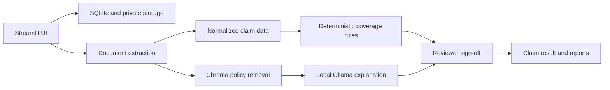

# Medi Gaurd AI

Medi Gaurd AI is a local Streamlit mini-project that demonstrates a clear,
evidence-led health-insurance claim workflow. It extracts synthetic medical
bills and policy documents, applies deterministic coverage rules, retrieves
relevant policy clauses, and presents an explainable result for a reviewer or
claimant.

> This is an academic prototype using synthetic demonstration material. It is
> not an insurer decision system and must not be used with real patient data.

## What it demonstrates

- Claimant registration, document upload, and claim-result views.
- Separate User and Admin/Reviewer entry paths.
- OCR and text extraction for PDF and image documents.
- Structured claim normalization with source evidence and confidence signals.
- Deterministic deductible, copayment, limit, and exclusion calculations.
- Policy evidence retrieval with Chroma and a local Ollama-assisted explanation.
- Reviewer sign-off plus downloadable decision and appeal-draft documents.

## Architecture



## Run locally

### Prerequisites

- Python 3.11 or newer
- [Tesseract OCR](https://github.com/tesseract-ocr/tesseract) installed locally
- [Ollama](https://ollama.com/) with `ibm/granite4.1:8b` available for the
  agent workflow

### Setup

```powershell
py -3 -m venv .venv
.\.venv\Scripts\Activate.ps1
python -m pip install --upgrade pip
pip install -r requirements.txt
Copy-Item .env.example .env
ollama serve
```

Start the normal local application:

```powershell
.\.venv\Scripts\python.exe -m streamlit run app.py
```

Open `http://127.0.0.1:8505`.

## Roles and entry flow

The opening page lets a visitor choose a workspace.

- **User / claimant:** can sign in or create a claimant account, register a
  claim, upload documents, and view the claimant-safe result.
- **Admin / reviewer:** can only sign in with an authorized account. This
  workspace provides review, evidence, policy, and user-management functions.

With the default synthetic-demo configuration, the administrator account is:

```text
Email:    demo@mediguard.local
Password: Mediguard@2026
```

Set `DEMO_ADMIN_PASSWORD` before starting the application to replace that local
demo password. Never use the default credentials or synthetic-demo mode for a
real deployment.

## Demonstration mode

Run the isolated synthetic demo on port 8506:

```powershell
.\.venv\Scripts\python.exe run_demo.py
```

It uses `data/final_demo` and keeps normal local data separate. The tracked
files in `demo_assets/` provide three repeatable walkthroughs:

| Case | Files | Expected outcome |
| --- | --- | --- |
| Approved | `approved_policy.pdf`, `approved_bill.pdf` | Approved; payable INR 67,500 |
| Partially approved | `partial_policy.pdf`, `partial_bill.pdf` | Partially approved; payable INR 81,000 |
| Manual review | Approved files with a mismatched registered policy number | Manual review; calculation blocked |

## Verification

Run the focused checks:

```powershell
.\.venv\Scripts\python.exe test_core_advancements.py
.\.venv\Scripts\python.exe test_ui_audit.py
.\.venv\Scripts\python.exe test_demo_scenarios.py
```

For the complete local suite, including OCR, retrieval, and Ollama integration:

```powershell
.\.venv\Scripts\python.exe run_full_audit_suite.py
```

## Repository layout

```text
app.py                    Streamlit interface, authentication, and workflow orchestration
extraction.py             OCR and document field extraction
rules.py                  Deterministic coverage calculation
agents.py                 Local policy retrieval and explanation workflow
policy_index.py           Chroma policy indexing
policy_terms.py           Policy-term normalization
reports.py                PDF decision report and appeal draft generation
fixtures/phase4/          Tracked OCR and rule-test fixtures
demo_assets/              Small synthetic files for the walkthrough
test_*.py                 Reproducible verification scripts
```

## Limits

The prototype has no insurer integration, production deployment, clinical
validation, or real-data security certification. OCR ambiguity, unfamiliar
policy wording, and missing evidence must be resolved by an authorized human
reviewer.
